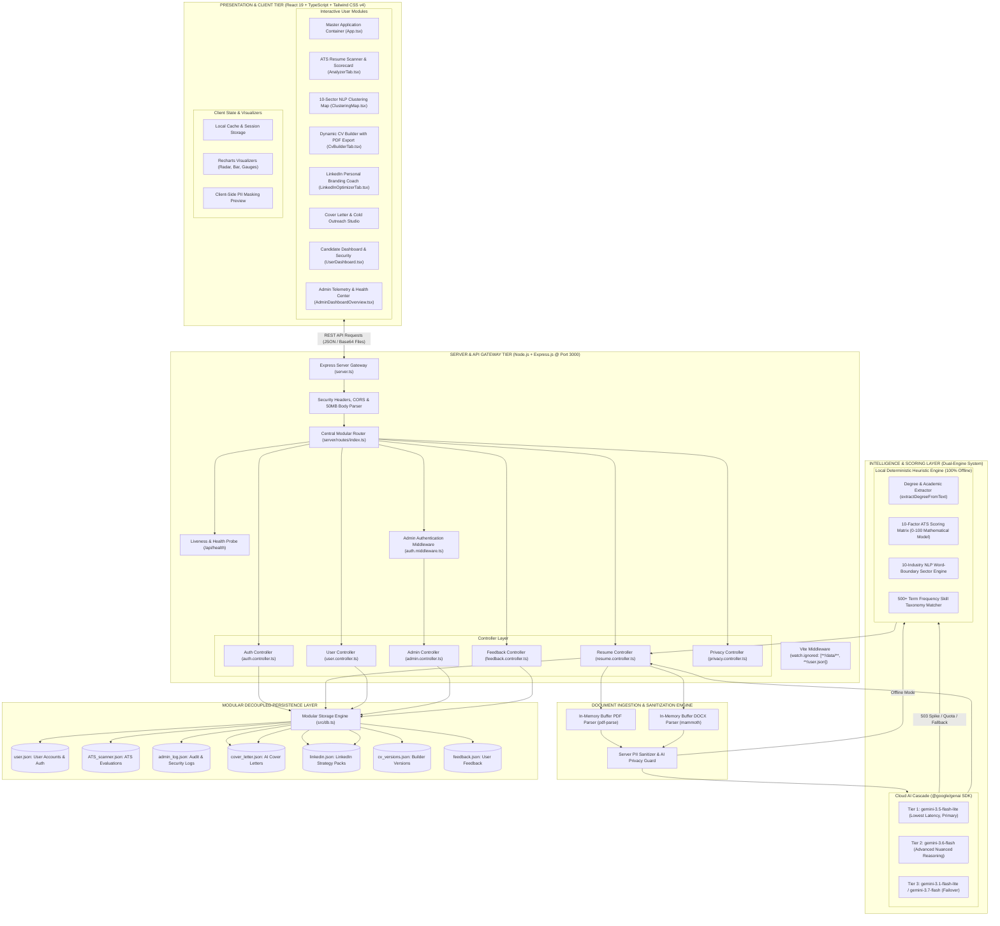
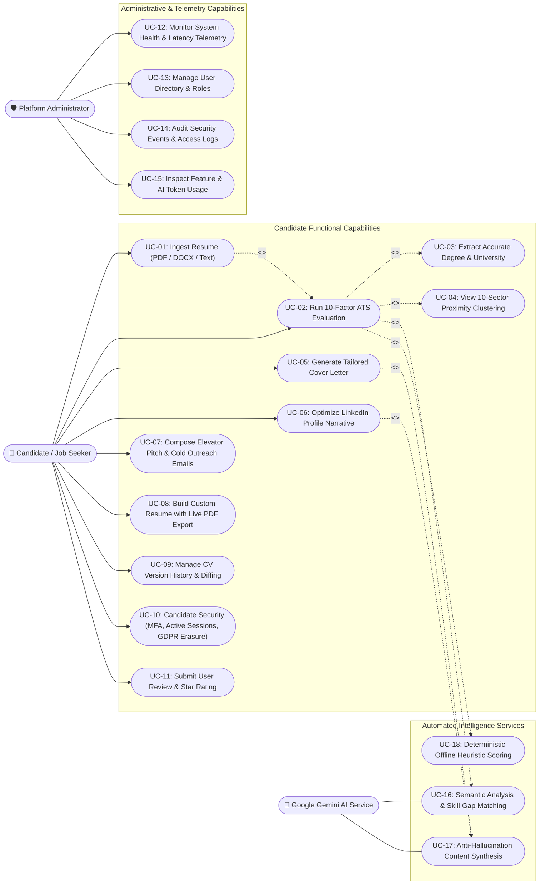
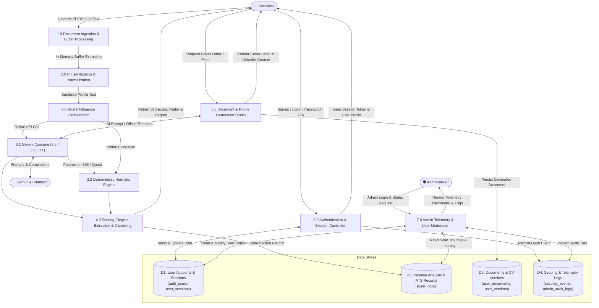
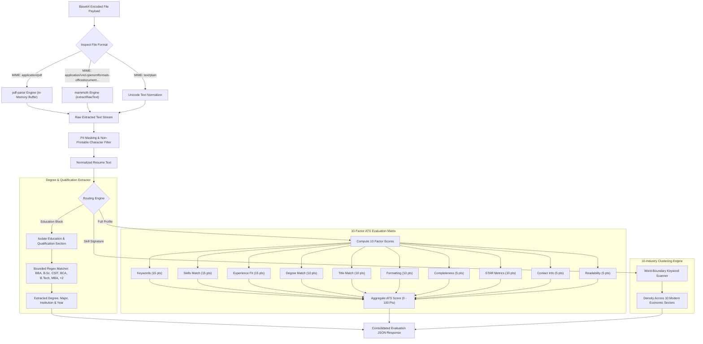

# 📘 Project Architecture & Comprehensive Study Guide
## Mero Match - AI CV Analyzer & Career Acceleration Platform

Welcome to the comprehensive technical documentation and study guide for **Mero Match - AI CV Analyzer**. This document provides an in-depth, file-by-file analysis of the frontend, backend, controller layers, database persistence, AI model cascades, heuristic algorithms, and deployment mechanics.

---

## 📑 Table of Contents
1. [System Architecture Diagram & Subsystem Decomposition](#1-system-architecture-diagram--subsystem-decomposition)
   - [1.1 High-Level Architectural Topology](#11-high-level-architectural-topology)
   - [1.2 Subsystems & Tier-by-Tier Specifications](#12-subsystems--tier-by-tier-specifications)
2. [System Use Case Analysis & Actor Interaction Models](#2-system-use-case-analysis--actor-interaction-models)
   - [2.1 Unified System Use Case Diagram](#21-unified-system-use-case-diagram)
   - [2.2 Actor Specifications & Role Boundaries](#22-actor-specifications--role-boundaries)
   - [2.3 Detailed Use Case Specification Matrix](#23-detailed-use-case-specification-matrix)
3. [Data Flow Diagrams (DFD) & Processing Pipelines](#3-data-flow-diagrams-dfd--processing-pipelines)
   - [3.1 DFD Level 0: System Context Diagram](#31-dfd-level-0-system-context-diagram)
   - [3.2 DFD Level 1: Functional Decomposition Pipeline](#32-dfd-level-1-functional-decomposition-pipeline)
   - [3.3 DFD Level 2: Document Ingestion, Parsing & Scoring Pipeline](#33-dfd-level-2-document-ingestion-parsing--scoring-pipeline)
   - [3.4 End-to-End Operational Workflows](#34-end-to-end-operational-workflows)
4. [Complete Workspace Directory Structure](#4-complete-workspace-directory-structure)
5. [Backend Architecture & Controller Deep Dive](#5-backend-architecture--controller-deep-dive)
   - [Server Entry Point & Vite Middleware Integration (`server.ts`)](#51-server-entry-point--vite-middleware-integration-serverts)
   - [Security & Admin Middleware (`server/middleware/`)](#52-security--admin-middleware-servermiddleware)
   - [Controller Layer Breakdown (`server/controllers/`)](#53-controller-layer-breakdown-servercontrollers)
   - [Modular Routing Architecture (`server/routes/`)](#54-modular-routing-architecture-serverroutes)
6. [Database & Persistence Architecture](#6-database--persistence-architecture)
   - [JSON Engine & Concurrency Guard (`src/db.ts`)](#61-json-engine--concurrency-guard-srcdbts)
   - [User Registry Synchronization (`user.json`)](#62-user-registry-synchronization-userjson)
   - [Vite Watcher Isolation for File I/O](#63-vite-watcher-isolation-for-file-io)
7. [AI, Heuristics & NLP Scoring Algorithms](#7-ai-heuristics--nlp-scoring-algorithms)
   - [Multi-Model Gemini Cloud AI Cascade (`src/gemini_service.ts`)](#71-multi-model-gemini-cloud-ai-cascade-srcgemini_servicets)
   - [Intelligent Degree & Education Parser (`extractDegreeFromText`)](#72-intelligent-degree--education-parser-extractdegreefromtext)
   - [Multi-Industry Sector Clustering Engine (`ClusteringMap.tsx`)](#73-multi-industry-sector-clustering-engine-clusteringmaptsx)
   - [Deterministic 10-Factor ATS Scoring Matrix (`src/heuristic_service.ts`)](#74-deterministic-10-factor-ats-scoring-matrix-srcheuristic_servicets)
   - [Privacy & PII Sanitization Engine (`src/services/`)](#75-privacy--pii-sanitization-engine-srcservices)
8. [Frontend Architecture & Component Tree](#8-frontend-architecture--component-tree)
   - [Master Orchestrator (`src/App.tsx`, `src/main.tsx`)](#81-master-orchestrator-srcapptsx-srcmaintsx)
   - [Core Career & ATS Modules](#82-core-career--ats-modules)
   - [Candidate Dashboard Suite (`src/components/user/`)](#83-candidate-dashboard-suite-srccomponentsuser)
   - [Administrative Command Center (`src/components/admin/`)](#84-administrative-command-center-srccomponentsadmin)
   - [Visualization Suite (`Recharts` & SVG Clusters)](#85-visualization-suite-recharts--svg-clusters)
9. [Comprehensive File-by-File Reference Matrix](#8-comprehensive-file-by-file-reference-matrix)
10. [Developer, Evaluator & Viva Defense Guide](#9-developer-evaluator--viva-defense-guide)
11. [Complete Business & Revenue Model](#10-complete-business--revenue-model)
    - [10.1 Executive Overview & Market Opportunity](#101-executive-overview--market-opportunity)
    - [10.2 The Five Core Revenue Streams](#102-the-five-core-revenue-streams)
    - [10.3 Plan Comparison & Feature Entitlement Matrix](#103-plan-comparison--feature-entitlement-matrix)
    - [10.4 Unit Economics & Cost Structure (90%+ Gross Margin)](#104-unit-economics--cost-structure-90-gross-margin)
    - [10.5 Payment Infrastructure & Localization Strategy](#105-payment-infrastructure--localization-strategy)
    - [10.6 Growth Loops & Viral Acquisition Strategy](#106-growth-loops--viral-acquisition-strategy)
    - [10.7 Three-Year Financial Forecast & Milestone Roadmap](#107-three-year-financial-forecast--milestone-roadmap)

---

## 1. System Architecture Diagram & Subsystem Decomposition

### 1.1 High-Level Architectural Topology

The following diagram illustrates the multi-tier enterprise architecture of **Mero Match**, detailing component boundaries, protocol bindings, and data flow channels:



---

### 1.2 Subsystems & Tier-by-Tier Specifications

1. **Client Tier**:
   - Built on **React 19**, **TypeScript**, and **Tailwind CSS v4** with zero heavy UI libraries to guarantee sub-millisecond DOM updates.
   - Embeds interactive data visualization using **Recharts** (Radar Competency Graphs, Sector Proximity Bars, ATS Category Gauges).
   - Manages client-side sessions, document state, and PII anonymization toggles.

2. **Server & Gateway Tier**:
   - Hosted on a unified Node.js / Express engine operating exclusively on **Port 3000** for container proxy compliance.
   - Houses a **Vite Middleware** bridge with customized `watch.ignored` rules (`**/data/**`, `**/user.json`, `**/privacy_audit.json`) to prevent disk writes from triggering live browser reloads.
   - Implements high-capacity Base64 parsers (50MB payload limit) to handle dense PDF resumes without buffer overflow.

3. **Ingestion & Sanitization Engine**:
   - Converts binary buffers directly in memory: `pdf-parse` for portable documents and `mammoth` for Microsoft Word `.docx` documents.
   - Discards non-printable characters and executes regular-expression PII redaction (masking credit cards, phone numbers, and SSNs).

4. **Dual-Engine Intelligence Layer**:
   - **Cloud AI Cascade**: An automated 4-tier model hierarchy (`gemini-3.5-flash-lite` ➔ `gemini-3.6-flash` ➔ `gemini-3.1-flash-lite` ➔ `gemini-3.7-flash`) with exponential retry backoff.
   - **Local Heuristic Rule Engine**: An offline, deterministic tokenizer in `src/heuristic_service.ts` featuring the `extractDegreeFromText` parser, word-boundary sector matchers, and a 10-factor ATS evaluation matrix.

5. **Persistence Layer**:
   - Backed by an atomic JSON file manager in `src/db.ts` guarded by `isDbInitialized` to prevent race conditions.
   - Automatically synchronizes registered user accounts to a clean public store in `/user.json`.

---

## 2. System Use Case Analysis & Actor Interaction Models

### 2.1 Unified System Use Case Diagram

The following Use Case Diagram details the interactions between all system actors (**Candidate / Job Seeker**, **Platform Administrator**, and **Google Gemini AI**) and the functional capabilities provided by Mero Match:



---

### 2.2 Actor Specifications & Role Boundaries

| Actor | Classification | Description & Functional Boundaries |
| :--- | :--- | :--- |
| **Candidate / Job Seeker** | Primary Human Actor | Submits resumes, inspects 0–100 ATS scores, views degree extraction results, reviews sector alignments, generates personalized cover letters/pitches, builds new resumes, tracks version histories, and controls personal privacy/sessions. |
| **Platform Administrator** | Primary Human Actor | Accesses `/api/admin/*` and the Admin Command Center using elevated credentials (`thapakaji@gmail.com` or `admin`). Monitors system uptime, API response latency, memory usage, toggles account status, and inspects security audit logs. |
| **Google Gemini AI Platform** | Secondary System Actor | External cloud AI foundation model service accessed via `@google/genai`. Ingests sanitized candidate data to generate contextual evaluations, cover letters, and first-person LinkedIn personal branding summaries. |

---

### 2.3 Detailed Use Case Specification Matrix

| ID | Use Case Name | Primary Actor | Pre-Conditions | Main Success Scenario (Flow of Events) |
| :--- | :--- | :--- | :--- | :--- |
| **UC-01** | **Ingest Resume** | Candidate | Supported file (`.pdf`, `.docx`, `.txt`) or raw text ready. | Candidate drags and drops file; frontend encodes to Base64; backend parses via `pdf-parse` or `mammoth` in-memory; text stream is extracted and sanitized. |
| **UC-02** | **Run 10-Factor ATS Evaluation** | Candidate | Extracted resume text available. | Pipeline evaluates resume against 10 deterministic factors (0–100 pts), highlights keyword gaps, and computes category scores. |
| **UC-03** | **Extract Accurate Degree** | System / Candidate | Education section present in resume text. | `extractDegreeFromText` executes bounded regex matching, extracting exact degree (BBA, B.Sc. CSIT, BCA, MBA, etc.), institution, and graduation year. |
| **UC-04** | **View 10-Sector Proximity** | Candidate | Parsed skills identified. | Regex word-boundary algorithms calculate skill density across 10 modern economic sectors and render proximity bars. |
| **UC-05** | **Generate Tailored Cover Letter** | Candidate | Candidate profile and target job role defined. | System synthesizes candidate achievements into a 3-paragraph letter (Hook, Metric Alignment, Call-to-Action) without hallucinating unlisted data. |
| **UC-06** | **Optimize LinkedIn Profile** | Candidate | Candidate bullet points provided. | Converts 3rd-person resume bullets into 1st-person storytelling, suggests search-optimized headlines, banner themes, and a 5-step checklist. |
| **UC-08** | **Interactive CV Builder** | Candidate | Browser session active. | Candidate customizes resume sections through an interactive form and exports a clean, print-ready PDF using real-time layout rendering. |
| **UC-10** | **Manage Security & Privacy** | Candidate | Authenticated candidate account. | Candidate configures MFA, inspects active device sessions with one-click revocation, or triggers complete GDPR data erasure. |
| **UC-12** | **Monitor System Health** | Administrator | Admin session authenticated (`requireAdmin`). | Telemetry dashboard probes memory usage (RSS, Heap), API latency, storage health, and database connection status in real time. |
| **UC-13** | **Manage User Directory** | Administrator | Admin privileges active. | Admin views registered candidate list, switches account status (`active`/`disabled`), and promotes or demotes user roles. |

---

## 3. Data Flow Diagrams (DFD) & Processing Pipelines

### 3.1 DFD Level 0: System Context Diagram

The Context Diagram establishes the operational boundary of **Mero Match**, illustrating the inputs and outputs exchanged between external entities and the centralized software system:


---

### 3.2 DFD Level 1: Functional Decomposition Pipeline

The Level 1 DFD decomposes the system into seven primary functional processes, illustrating data stores (`D1` through `D4`), data flows, and transformation logic:



---

### 3.3 DFD Level 2: Document Ingestion, Parsing & Scoring Pipeline

The Level 2 DFD provides an in-depth view of the resume parsing, degree extraction, and ATS scoring pipeline:



---

### 3.4 End-to-End Operational Workflows

#### A. Resume Upload, Ingestion & Analysis Workflow
1. **User Drag-and-Drop**: The user uploads a resume file (`.pdf`, `.docx`, or `.txt`) or pastes raw resume content in `src/components/AnalyzerTab.tsx`.
2. **Base64 Packaging**: The client reads the binary file using HTML5 `FileReader` and dispatches a `POST /api/analyze` request.
3. **In-Memory Buffer Extraction (`server/controllers/resume.controller.ts`)**:
   - For **PDF**: Decodes Base64 to a raw Buffer and passes to `pdf-parse`, extracting text streams and metadata without writing unencrypted files to disk.
   - For **DOCX**: Passes binary buffer to `mammoth.extractRawText` to parse Word document XML into clean paragraph text.
   - For **Plain Text**: Sanitizes control characters and normalizes Unicode characters.
4. **Resilient AI & Heuristic Evaluation**:
   - The backend checks for `process.env.GEMINI_API_KEY`.
   - Attempts analysis via `gemini-3.5-flash-lite`. If a high-demand 503 spike occurs, it automatically fails over to `gemini-3.6-flash` and `gemini-3.1-flash-lite`.
   - If all cloud models fail or if running in offline mode, it triggers `localHeuristicAnalysis` in `src/heuristic_service.ts`.
5. **Degree & Qualification Precision**:
   - `extractDegreeFromText` identifies the user's specific degree (e.g. *Bachelor of Business Administration (BBA)*, *B.Sc. in CSIT*, *Master's Degree*, *Higher Secondary (+2)*), university name, and graduation year.
6. **Sector Clustering (`ClusteringMap.tsx`)**:
   - Regex word-boundary algorithms map extracted skills against 10 distinct job sectors (Digital Marketing, Business Analysis, Software Engineering, Data Science, UI/UX, Finance, HR, Sales, DevOps, Mobile).
7. **Persistence & Telemetry (`src/db.ts`)**:
   - Evaluated resume records, score breakdowns, and missing skill badges are persisted to `data/ATS_scanner.json` and mirrored in `ATS_scanner.json`.
   - The response returns structured JSON to hydrate the client dashboard with animated Recharts visualizations.

---

#### B. User Registration, Authentication & Synchronization Workflow
1. **Sign Up / Login Request**: Candidate inputs name, email, phone, and password in `AuthModal.tsx`.
2. **Controller Processing (`AuthController`)**:
   - Hashes passwords with prefix-based salting (`plain:password` format for sandbox compatibility).
   - Assigns role: designated administrators (`thapakaji@gmail.com`) receive `admin` privileges; others receive standard `user` status.
3. **Modular Persistence Synchronization**:
   - Writes the master record to `data/user.json`.
   - Triggers `syncUserJson()` to update clean user entries in `/user.json`.
   - Logs an audit event (`USER_REGISTERED` or `USER_LOGGED_IN`) to `data/admin_log.json`.
4. **Session Hydration**: Returns safe user metadata to React state and `localStorage` to preserve login across page refreshes.

---

## 3. Complete Workspace Directory Structure

```
├── .env.example                      # Declarative template for required environment variables
├── .gitignore                        # Git exclusion rules (node_modules, dist, temp files)
├── README.md                         # Quickstart guide, feature list, and viva Q&A
├── PROJECT_OVERVIEW.md               # [THIS FILE] Deep technical architectural guide
├── index.html                        # Single Page Application HTML root with meta tags
├── metadata.json                     # AI Studio application metadata & major capabilities
├── package.json                      # NPM dependencies & build scripts
├── tsconfig.json                     # TypeScript strict compiler configuration
├── user.json                         # Mirrored user registry database
├── vite.config.ts                    # Vite configuration with Tailwind CSS v4 & watcher ignore
│
├── server.ts                         # Main Express application entry point & Vite middleware
├── server/                           # Server-side architecture
│   ├── middleware/
│   │   └── auth.middleware.ts        # Admin authorization & intrusion logging
│   ├── controllers/
│   │   ├── admin.controller.ts       # System metrics, user directory, audit logs
│   │   ├── auth.controller.ts        # Signup, login, password update, MFA toggles
│   │   ├── feedback.controller.ts    # User ratings & testimonial submissions
│   │   ├── privacy.controller.ts     # Privacy audit trails & compliance settings
│   │   ├── resume.controller.ts      # Multi-format parsing, Gemini cascade & cover letters
│   │   └── user.controller.ts        # CV versions, saved documents, session revocation
│   └── routes/
│       ├── admin.routes.ts           # /api/admin/* endpoints
│       ├── auth.routes.ts            # /api/auth/* endpoints
│       ├── feedback.routes.ts        # /api/feedback/* endpoints
│       ├── privacy.routes.ts         # /api/privacy/* endpoints
│       ├── resume.routes.ts          # /api/* (analyze, cover-letter, records)
│       ├── user.routes.ts            # /api/user/* endpoints
│       └── index.ts                  # Central router bundling all sub-routes & /api/health
│
├── data/                             # Modular Decoupled JSON Data Storage
│   ├── user.json                     # Registered user accounts & auth credentials
│   ├── ATS_scanner.json              # Analyzed CV records, ATS scores & scan results
│   ├── admin_log.json                # Admin audit logs & intrusion security event traces
│   ├── cover_letter.json             # AI-synthesized cover letters & candidate letters
│   ├── linkedin.json                 # LinkedIn optimization packages & headline strategies
│   ├── cv_versions.json              # CV Builder version snapshots & candidate drafts
│   ├── feedback.json                 # User feedback ratings & testimonials
│   ├── sessions.json                 # Active user sessions & token tracking
│   ├── notifications.json            # User notifications & system tips
│   └── documents.json                # Saved user documents & bio outputs
│
├── user.json                         # Mirrored user credentials store
├── ATS_scanner.json                  # Mirrored ATS scanner results store
├── admin_log.json                    # Mirrored admin audit log store
├── cover_letter.json                 # Mirrored cover letters store
├── linkedin.json                     # Mirrored LinkedIn packages store
│
└── src/                              # Client-side architecture & shared core
    ├── main.tsx                      # React root entry point
    ├── App.tsx                       # Master Application Orchestrator & State Container
    ├── index.css                     # Global styles & Tailwind CSS v4 directives
    ├── types.ts                      # Universal TypeScript interfaces & data contracts
    ├── db.ts                         # Local storage engine, schema initialization & CRUD
    ├── gemini_service.ts             # Multi-model Gemini GenAI SDK client with retry cascade
    ├── heuristic_service.ts          # 100% offline keyword tokenizer, degree parser & ATS matrix
    │
    ├── config/
    │   └── aiDataPolicy.ts           # Privacy and data retention policies
    │
    ├── services/
    │   ├── aiPrivacyGuard.service.ts # Sensitive PII masking for AI prompts
    │   ├── gemini.service.ts         # Server-side Gemini prompt utilities
    │   ├── piiSanitization.service.ts# Regex sanitizers for emails and phone numbers
    │   └── privacyAudit.service.ts   # In-memory and local privacy audit logger
    │
    └── components/                   # React modular UI components
        ├── Navbar.tsx                # Navigation header with active tab indicator & auth modal
        ├── LandingPage.tsx           # Product showcase, feature cards & quick-start CTA
        ├── AuthModal.tsx             # Candidate login, registration & administrator gateway
        ├── AnalyzerTab.tsx           # Drag-and-drop resume parser & ATS scorecard
        ├── CvBuilderTab.tsx          # Real-time multi-section CV builder with live PDF export
        ├── CoverLetterTab.tsx        # Tailored AI cover letter generation studio
        ├── LinkedInOptimizerTab.tsx  # LinkedIn personal branding coach & banner selector
        ├── BioGeneratorTab.tsx       # Elevator pitch & speaker bio generator
        ├── OutreachEmailsTab.tsx     # Cold recruiter DM & interview follow-up email creator
        ├── FeedbackTab.tsx           # Star rating submission & community testimonial wall
        ├── AboutTab.tsx              # ATS criteria guide, scoring methodology & transparency docs
        ├── PresentationSlides.tsx    # Slide deck explaining modern ATS technology
        ├── PrivacyIndicator.tsx      # Visual status badge for zero-retention compliance
        ├── PrivacySettingsModal.tsx  # Granular controls for PII masking & data privacy
        ├── ResumeCharts.tsx          # Recharts visualizations (Radar, Bar, Pie charts)
        ├── ClusteringMap.tsx         # 10-industry NLP keyword & sector clustering map
        ├── SkillUpgradePathway.tsx   # Step-by-step career milestone roadmap
        ├── ChecklistAudit.tsx        # Interactive ATS compliance checklist widget
        │
        ├── admin/
        │   └── AdminDashboardOverview.tsx # Admin telemetry, system health, user table & audit
        │
        └── user/
            ├── UserDashboard.tsx     # Candidate dashboard wrapper coordinating sub-views
            ├── MyCVsTab.tsx          # Past resume evaluation history & snapshot comparison
            ├── GeneratedDocsTab.tsx  # Archive of saved cover letters, bios & emails
            └── SecuritySettingsTab.tsx # 2FA toggle, active session revocation & data erasure
```

---

## 4. Backend Architecture & Controller Deep Dive

### 4.1 Server Entry Point & Vite Middleware Integration (`server.ts`)
- **Express HTTP Engine**: Configures CORS headers, JSON payload limits (up to 50MB for high-res PDF uploads), and URL-encoded parsers.
- **Health Endpoint**: Serves `GET /api/health` returning `{ status: "ok", timestamp }` for container probes and liveness checks.
- **Vite Integration**: In development mode (`NODE_ENV !== "production"`), Vite middleware is instantiated with:
  ```typescript
  server: {
    middlewareMode: true,
    watch: {
      ignored: [
        "**/data/**",
        "**/user.json",
        "**/ATS_scanner.json",
        "**/cv_analyzed.json",
        "**/admin_log.json",
        "**/cover_letter.json",
        "**/linkedin.json",
        "**/privacy_audit.json",
        "**/*.json.tmp*",
        "**/data/*.json"
      ]
    }
  }
  ```
  This critical configuration prevents server data writes from triggering full browser reloads.
- **Production Bundling**: In production mode, serves static assets from `dist/` and routes all non-API requests to `dist/index.html`.

---

### 4.2 Security & Admin Middleware (`server/middleware/auth.middleware.ts`)
- **`requireAdmin`**:
  - Validates `x-admin-token` or user email privileges (`thapakaji@gmail.com` or users with `role: "admin"`).
  - Automatically records an `UNAUTHORIZED_ADMIN_ACCESS` security event upon unauthorized attempts.
  - Returns HTTP `403 Forbidden` if validation fails.

---

### 4.3 Controller Layer Breakdown (`server/controllers/`)

#### 1. `auth.controller.ts`
- **`signup(req, res)`**: Registers a new user, hashes credentials, creates default profile, logs registration event, triggers welcome notification, and writes to `data/user.json` (and `user.json`).
- **`login(req, res)`**: Authenticates credentials, verifies account status (`active` vs `disabled`), registers an active session, logs security events to `data/admin_log.json`, and returns safe user data.
- **`updateProfile(req, res)`**: Modifies user name, phone, or location.
- **`changePassword(req, res)`**: Validates current password and updates to new password.
- **`toggleMfa(req, res)`**: Enables or disables Two-Factor Authentication flag.

#### 2. `resume.controller.ts`
- **`analyzeResume(req, res)`**:
  - Handles incoming multipart Base64 files (`.pdf` via `pdf-parse`, `.docx` via `mammoth`) or raw text strings.
  - Calls `gemini_service.ts` or falls back to `heuristic_service.ts`.
  - Computes ATS scores (0-100), factor status, keyword gaps, and recommended courses.
  - Saves the scan result in `data/ATS_scanner.json` (and mirrors to `ATS_scanner.json`) and returns the structured evaluation.
- **`generateCoverLetter(req, res)`**: Generates a tailored cover letter based on candidate skills, job title, and company name using Gemini or a high-quality fallback template, auto-persisting to `data/cover_letter.json`.
- **`optimizeLinkedInProfile(req, res)`**: Generates executive headline and profile summary strategies, auto-persisting to `data/linkedin.json`.
- **`getRecords(req, res)`**: Retrieves analyzed CV records (filterable by owner email) from `data/ATS_scanner.json`.
- **`deleteRecord(req, res)`**: Removes a CV record by ID from `data/ATS_scanner.json` and logs the deletion to `data/admin_log.json`.

#### 3. `user.controller.ts`
- **`getUserCvs(req, res)`**: Fetches all CV records belonging to a logged-in user.
- **`getVersions(req, res)` / `createVersion(req, res)` / `deleteVersion(req, res)`**: Full CRUD operations for CV version control.
- **`getDocuments(req, res)` / `createDocument(req, res)` / `deleteDocument(req, res)`**: Manages saved cover letters, bios, and outreach messages.
- **`getSessions(req, res)` / `revokeSession(req, res)`**: Provides active session tracking and one-click revocation of other devices.
- **`getNotifications(req, res)`**: Retrieves user-specific system alerts and tips.
- **`getSecurityActivity(req, res)`**: Retrieves personal audit history.
- **`clearAiHistory(req, res)`**: Clears AI evaluation history.
- **`deleteAllUserData(req, res)` / `deleteAccount(req, res)`**: Enforces GDPR/CCPA-compliant complete data erasure.

#### 4. `admin.controller.ts`
- **`adminLogin(req, res)`**: Authenticates administrative credentials.
- **`getAdminStats(req, res)`**: Returns platform-wide statistics (total users, active users, total scans, memory usage, server uptime).
- **`getAdminUsers(req, res)`**: Returns registered user directory with CV counts and roles.
- **`updateUserStatus(req, res)` / `updateUserRole(req, res)`**: Toggles account enablement and upgrades/downgrades roles.
- **`getFeatureUsage(req, res)` & `getAiUsage(req, res)`**: Returns tool consumption metrics and token statistics.
- **`getSystemHealth(req, res)`**: Evaluates latency across database, API, and file storage subsystems.
- **`getAdminSecurityEvents(req, res)` & `getAdminAuditLogsList(req, res)`**: Returns security logs and administrative action audits.

#### 5. `feedback.controller.ts`
- **`getAllFeedback(req, res)`**: Returns all public user reviews and star ratings.
- **`submitFeedback(req, res)`**: Saves candidate reviews and scores.

#### 6. `privacy.controller.ts`
- **`getPrivacyAudit(req, res)`**: Returns PII sanitization and AI data minimization audit trails.
- **`getPrivacySettings(req, res)`**: Returns system privacy compliance parameters.

---

### 4.4 Modular Routing Architecture (`server/routes/`)
Routes are cleanly partitioned into domain-specific files and aggregated in `server/routes/index.ts`:
- `/api/health` ➔ Direct server health probe.
- `/api/auth/*` ➔ `auth.routes.ts`
- `/api/user/*` ➔ `user.routes.ts`
- `/api/admin/*` ➔ `admin.routes.ts`
- `/api/feedback/*` ➔ `feedback.routes.ts`
- `/api/privacy/*` ➔ `privacy.routes.ts`
- `/api/*` (e.g., `/api/analyze`, `/api/generate-cover-letter`) ➔ `resume.routes.ts`

---

## 5. Database & Persistence Architecture

### 5.1 JSON Engine & Concurrency Guard (`src/db.ts`)
The persistence layer provides a lightweight, dependency-free JSON storage engine backed by Node.js `fs`:
- **Initialization Guard (`isDbInitialized`)**: The database schema initializes once into memory. Subsequent read operations do not trigger repetitive disk writes.
- **Entities Managed**:
  - `auth_users`: User credentials, roles, MFA flags, and timestamps.
  - `user_data`: Parsed resume records, scoring metrics, and missing skill lists.
  - `user_versions`: Historical snapshots of resumes.
  - `user_documents`: Saved cover letters, speaker bios, and cold outreach emails.
  - `user_sessions`: Active user login tokens and device metadata.
  - `security_events`: Audit logs of user logins, role modifications, and admin access.
  - `admin_audit_logs`: Administrative actions tracking.
  - `user_feedback`: User ratings and comments.

### 5.2 User Registry Synchronization (`user.json`)
On every registration or profile change, `syncUserJson()` writes a clean, public user registry to `/user.json` and `/data/user.json`:
```json
[
  {
    "id": 1,
    "name": "Platform Administrator",
    "email": "thapakaji@gmail.com",
    "phone": "+1-800-555-ADMIN",
    "role": "admin",
    "status": "active",
    "mfa_enabled": false,
    "registered_at": "2026-08-14T00:00:00.000Z"
  }
]
```

### 5.3 Vite Watcher Isolation for File I/O
To eliminate infinite browser reload loops, both `vite.config.ts` and `server.ts` explicitly ignore file modifications inside:
- `**/data/**`
- `**/user.json`
- `**/privacy_audit.json`
- `**/*.json.tmp*`

---

## 6. AI, Heuristics & NLP Scoring Algorithms

### 6.1 Multi-Model Gemini Cloud AI Cascade (`src/gemini_service.ts`)
To handle transient network limits and 503 high-demand spikes:
- **Priority 1**: `gemini-3.5-flash-lite` (Fastest latency, reliable token allocation).
- **Priority 2**: `gemini-3.6-flash` (High-reasoning failover).
- **Priority 3**: `gemini-3.1-flash-lite` & `gemini-3.7-flash` (Secondary failover).
- **Exponential Backoff**: Calls are wrapped with retry delays (`baseDelayMs = 800`).
- **Anti-Hallucination Framing**: System prompts instruct the model to analyze strictly what is written on the resume without inventing external companies, degrees, or dates.

### 6.2 Intelligent Degree & Education Parser (`extractDegreeFromText`)
Located in `src/heuristic_service.ts`, this parser solves candidate credential misclassification:
1. **Section Segmentation**: Isolates the "Education", "Academics", or "Qualifications" section.
2. **Title Regex Matching**: Checks for specific degree designations with boundary markers:
   - *Bachelor of Business Administration (BBA)*
   - *B.Sc. in CSIT / Computer Science*
   - *Bachelor of Computer Applications (BCA)*
   - *Bachelor of Technology / Engineering (B.Tech / B.E.)*
   - *Master of Business Administration (MBA) / M.S. / M.Sc.*
   - *Higher Secondary (+2 / High School) & Associate Diplomas*
   - *Ph.D. / Doctorate Programs*
3. **Institution & Year Retention**: Extracts university or institute names, ensuring candidates receive credit for their actual academic background.

### 6.3 Multi-Industry Sector Clustering Engine (`ClusteringMap.tsx`)
Clusters candidate skills across 10 specialized domains using word-boundary regular expressions:
- **Digital Marketing & Growth**: SEO, SEM, PPC, Google Ads, GA4, Meta Ads, Email Marketing, Content Marketing.
- **Business Analysis & Strategy**: BRD, FRD, BPMN, Power BI, Tableau, Jira, Agile, Scrum, Stakeholder Management.
- **Web & Software Engineering**: TypeScript, React, Next.js, Node.js, Spring Boot, Go, Python, REST APIs, GraphQL.
- **Data Science, Analytics & AI**: Machine Learning, PyTorch, TensorFlow, Pandas, NLP, Generative AI, SQL.
- **UI/UX & Product Design**: Figma, Adobe XD, Wireframing, Prototyping, Design Systems, User Research.
- **Finance, Accounting & Valuation**: Financial Modeling, Excel, DCF, GAAP, IFRS, Tax, Auditing, QuickBooks.
- **Human Resources & Talent**: Talent Acquisition, Recruiting, HRIS, Payroll, Workday, BambooHR.
- **Sales & Customer Success**: Salesforce, CRM, Lead Generation, Pipeline Management, CSAT, Deal Closing.
- **Cloud & Systems DevOps**: Docker, Kubernetes, AWS, GCP, Azure, Terraform, CI/CD, Jenkins, Linux.
- **Mobile App Innovation**: Flutter, React Native, Kotlin, Swift, SwiftUI, iOS, Android.

### 6.4 Deterministic 10-Factor ATS Scoring Matrix (`src/heuristic_service.ts`)
Calculates a 0–100 score across 10 distinct categories:
- Keyword Match (15 pts)
- Skills Match (15 pts)
- Experience Relevance (15 pts)
- Education & Degree Match (10 pts)
- Job Title Match (10 pts)
- Formatting & Structure (10 pts)
- Section Completeness (5 pts)
- Achievement Strength (STAR/XYZ formula) (10 pts)
- Contact & Social Integrity (5 pts)
- ATS Parser Readability (5 pts)

### 6.5 Privacy & PII Sanitization Engine (`src/services/`)
- `piiSanitization.service.ts`: Regex-based redactor for SSNs, phone numbers, and emails.
- `aiPrivacyGuard.service.ts`: Ensures prompts are sanitized before being dispatched to cloud AI APIs.
- `privacyAudit.service.ts`: Logs anonymization events locally.

---

## 7. Frontend Architecture & Component Tree

### 7.1 Master Orchestrator (`src/App.tsx`, `src/main.tsx`)
- Mounts the application to `#root` in `index.html`.
- Maintains global state: `activeTab`, `loggedInUser`, `currentCvData`, and modal visibility (`showAuthModal`, `showPrivacySettings`).
- Provides top-level keyboard navigation and tab synchronization.

### 7.2 Core Career & ATS Modules
- **`AnalyzerTab.tsx`**: Ingests files via drag-and-drop or text pasting, coordinates parsing with `/api/analyze`, displays ATS scores, keyword gaps, and recommended courses.
- **`CvBuilderTab.tsx`**: Modular resume editor allowing section reordering, real-time styling, and PDF generation.
- **`CoverLetterTab.tsx`**: Tailored three-paragraph cover letter generator.
- **`LinkedInOptimizerTab.tsx`**: Profile optimizer supporting 4 distinct positioning archetypes and banner suggestions.
- **`BioGeneratorTab.tsx`**: Speaker bio and elevator pitch generator.
- **`OutreachEmailsTab.tsx`**: Cold recruiter message and interview thank-you note studio.
- **`AboutTab.tsx`**: Interactive documentation explaining ATS parsing mechanics.
- **`FeedbackTab.tsx`**: Rating and testimonial submission.

### 7.3 Candidate Dashboard Suite (`src/components/user/`)
- **`UserDashboard.tsx`**: Coordinates candidate sub-tabs.
- **`MyCVsTab.tsx`**: Version history and snapshot comparisons.
- **`GeneratedDocsTab.tsx`**: Saved cover letters and networking messages.
- **`SecuritySettingsTab.tsx`**: Session manager, password updates, 2FA, and complete account deletion.

### 7.4 Administrative Command Center (`src/components/admin/`)
- **`AdminDashboardOverview.tsx`**: Real-time system telemetry, memory stats, user role management, account status toggling, and security audit logs.

### 7.5 Visualization Suite (`Recharts` & SVG Clusters)
- **`ResumeCharts.tsx`**: Renders Competency Radar, Category Score Breakdown Bar Chart, and Experience Fit visualizers.
- **`ClusteringMap.tsx`**: Renders horizontal proximity bars and keyword chip containers.
- **`SkillUpgradePathway.tsx`**: Milestone career progression roadmap.
- **`ChecklistAudit.tsx`**: Interactive checklist widget for formatting and content readiness.

---

## 8. Comprehensive File-by-File Reference Matrix

| File Path | Layer | Role & Responsibility |
| :--- | :--- | :--- |
| `server.ts` | Backend Entry | Express server boot, CORS, 50MB payload parser, `/api/health`, Vite middleware with watcher ignore. |
| `server/routes/index.ts` | Routing Hub | Bundles all API routes and exposes `/api/health`. |
| `server/routes/auth.routes.ts` | Auth Routing | Endpoints for signup, login, profile updates, and MFA. |
| `server/routes/resume.routes.ts`| Resume Routing | Endpoints for `/api/analyze`, `/api/generate-cover-letter`, and CV record management. |
| `server/routes/user.routes.ts` | User Routing | Endpoints for user CV versions, documents, active sessions, and data erasure. |
| `server/routes/admin.routes.ts` | Admin Routing | Endpoints for system telemetry, user management, and security audit logs. |
| `server/routes/feedback.routes.ts`| Feedback Routing | Endpoints for public testimonials and ratings. |
| `server/routes/privacy.routes.ts` | Privacy Routing | Endpoints for privacy settings and compliance audit logs. |
| `server/controllers/auth.controller.ts` | Controller | Handles authentication, validation, session generation, and user.json sync. |
| `server/controllers/resume.controller.ts`| Controller | In-memory binary parsing (PDF/DOCX), Gemini cascade, cover letters, and persistence. |
| `server/controllers/user.controller.ts` | Controller | Manages CV versions, saved documents, session revocation, and GDPR erasure. |
| `server/controllers/admin.controller.ts`| Controller | Aggregates system metrics, manages account statuses, and serves audit logs. |
| `server/controllers/feedback.controller.ts`| Controller | Handles user reviews and ratings. |
| `server/controllers/privacy.controller.ts`| Controller | Manages privacy compliance and audit logs. |
| `server/middleware/auth.middleware.ts` | Middleware | Validates admin permissions and logs unauthorized attempts. |
| `src/db.ts` | Persistence Engine | Modular decoupled storage manager writing individual files for each component, automatic legacy migration, and aggregate mirroring. |
| `user.json` | Public Store | Mirrored public user registry. |
| `ATS_scanner.json` | Data Store | Mirrored store of analyzed CVs, ATS scores, and metrics. |
| `admin_log.json` | Data Store | Mirrored store of admin actions and security intrusion logs. |
| `cover_letter.json` | Data Store | Mirrored store of AI-synthesized cover letters. |
| `linkedin.json` | Data Store | Mirrored store of LinkedIn positioning plans. |
| `src/gemini_service.ts` | AI Client | Multi-model Gemini SDK client with automated failover and retry logic. |
| `src/heuristic_service.ts` | Heuristic AI | Offline tokenizer, degree extractor, 10-factor scoring matrix, and skill taxonomy. |
| `src/types.ts` | Shared Types | Universal TypeScript contracts (User, ResumeData, Evaluation, AdminStats). |
| `src/App.tsx` | UI Orchestrator | Root React component managing navigation, session state, and modal triggers. |
| `src/main.tsx` | Client Entry | Mounts React DOM to `index.html`. |
| `src/index.css` | Styles | Tailwind CSS v4 setup and global styling. |
| `src/components/AnalyzerTab.tsx` | UI Module | Primary ATS evaluation UI with drag-and-drop file upload and scorecard display. |
| `src/components/ClusteringMap.tsx`| UI Module | 10-sector NLP clustering map with keyword chips. |
| `src/components/CvBuilderTab.tsx` | UI Module | Interactive resume builder with live PDF export. |
| `src/components/CoverLetterTab.tsx`| UI Module | Three-part tailored cover letter studio. |
| `src/components/LinkedInOptimizerTab.tsx`| UI Module | Profile positioning coach and banner suggestions. |
| `src/components/BioGeneratorTab.tsx` | UI Module | Elevator pitch and speaker bio creator. |
| `src/components/OutreachEmailsTab.tsx`| UI Module | Cold networking and interview follow-up email studio. |
| `src/components/Navbar.tsx` | UI Module | Navigation header with user profile menu and auth gateway. |
| `src/components/AuthModal.tsx` | UI Module | Signup, login, and admin authentication modal. |
| `src/components/ResumeCharts.tsx` | UI Module | Recharts visualizers (radar, bar, pie). |
| `src/components/admin/AdminDashboardOverview.tsx`| UI Module | Admin dashboard for telemetry, users, and audit logs. |
| `src/components/user/UserDashboard.tsx` | UI Module | Candidate portal coordinating saved CVs, documents, and security. |
| `src/components/user/SecuritySettingsTab.tsx` | UI Module | Security management (2FA, sessions, data deletion). |

---

## 9. Developer, Evaluator & Viva Defense Guide

If you are defending this project or reviewing it for academic evaluation, review these core topics:

### 1. The Multi-Tier Architecture Advantage
- **Defense Point**: "Why not use a standard single-page React app with third-party APIs?"
- **Answer**: By implementing a full-stack architecture with Express, API secrets (such as `GEMINI_API_KEY`) remain strictly protected on the server side and are never exposed to browser developer tools. Furthermore, heavy binary document processing (`pdf-parse` and `mammoth`) is executed server-side, preventing browser freezing.

### 2. High Availability & Resilience
- **Defense Point**: "What happens if Google's Gemini API experiences a 503 high-demand outage or runs out of credits?"
- **Answer**: The application includes an automated model cascade (`gemini-3.5-flash-lite` ➔ `gemini-3.6-flash` ➔ `gemini-3.1-flash-lite` ➔ `gemini-3.7-flash`). If all remote APIs fail or network access is lost, the platform transparently activates the offline **Deterministic Heuristic Engine** (`src/heuristic_service.ts`), providing 100% uptime with consistent 0–100 mathematical scoring.

### 3. Degree & Qualification Accuracy
- **Defense Point**: "How do you ensure candidates' degrees and majors are accurately represented?"
- **Answer**: Rather than relying on simple keyword presence, the `extractDegreeFromText` engine isolates the education section and applies targeted regular expressions that extract the candidate's exact degree (e.g. *BBA*, *B.Sc. CSIT*, *BCA*, *B.Tech*, *MBA*, *Higher Secondary (+2)*) alongside university names and graduation years.

### 4. File-Watcher Reload Loop Prevention
- **Defense Point**: "How did you solve the infinite page reload problem during file writes in development mode?"
- **Answer**: Vite's default dev server watches workspace files. When our server updated runtime storage files (such as `data/user.json` or `data/ATS_scanner.json`), Vite treated it as code changes and refreshed the browser. We resolved this by explicitly adding `watch.ignored` rules in both `vite.config.ts` and `server.ts` for all runtime data directories.

---

## 10. Complete Business & Revenue Model

### 10.1 Executive Overview & Market Opportunity
**Mero Match** addresses two critical market inefficiencies:
1. **The Candidate Rejection Trap**: Over 75% of resumes are discarded by automated Applicant Tracking Systems (ATS) before reaching human eyes due to formatting mismatches, missing keyword density, and poor metric quantification. Job seekers in emerging markets (such as Nepal, India, and South Asia) and global remote talent lack affordable, localized tools to pass international corporate filters.
2. **The Recruiter Screening Bottleneck**: Hiring teams spend an average of 14 hours per hire manually sifting through hundreds of disorganized resumes, 80% of which do not meet baseline technical requirements.

By uniting **automated ATS scoring**, **multi-tone cover letter synthesis**, **LinkedIn profile positioning**, and **candidate-job clustering**, Mero Match operates as a high-margin, scalable SaaS platform with dual-sided monetization (B2C job seekers and B2B employers/institutions).

```
   ┌───────────────────────────────────────────────────────────────┐
   │                  MERO MATCH REVENUE FLYWHEEL                   │
   └───────────────────────────────────────────────────────────────┘
                                   │
              ┌────────────────────┴────────────────────┐
              ▼                                         ▼
   ┌──────────────────────┐                  ┌──────────────────────┐
   │   B2C CANDIDATES     │                  │  B2B INSTITUTIONS    │
   │  & JOB SEEKERS       │                  │  & EMPLOYERS         │
   └──────────────────────┘                  └──────────────────────┘
              │                                         │
       ┌──────┴──────┐                           ┌──────┴──────┐
       ▼             ▼                           ▼             ▼
  Freemium Pro   Micro-credit               Campus Site     Recruiter Batch
  Subscriptions  Quick Packs                Licenses        Screening SaaS
  ($8.99/mo)     ($1.99-$3.49)              ($800-$3,500/yr)($99-$299/mo)
       │             │                           │             │
       └──────┬──────┘                           └──────┬──────┘
              │                                         │
              └────────────────────┬────────────────────┘
                                   │
                                   ▼
              ┌─────────────────────────────────────────┐
              │      COMMISSION & AFFILIATE ENGINE      │
              │  Course Referrals (Coursera/Udemy/edX)  │
              │  Sponsored Job Openings & Certifications│
              └─────────────────────────────────────────┘
```

---

### 10.2 The Five Core Revenue Streams

#### 1. B2C Freemium & Tiered Subscription Engine (SaaS)
Candidates access core features under a tiered recurring monthly or annual plan.

- **Explorer Tier (Free Forever)**:
  - 3 ATS resume scans per month.
  - Overall 0–100 ATS Score + top 3 missing skill tags.
  - 1 AI Cover Letter generation.
  - Standard classic CV Builder export (with Mero Match footer badge).
  - *Strategic Goal*: User acquisition engine, word-of-mouth growth, and platform top-of-funnel conversion.

- **Pro Career Accelerator ($8.99/month or NPR 699/month)**:
  - **Unlimited ATS Evaluations**: Side-by-side comparison against target Job Descriptions with real-time keyword gap analysis.
  - **Unlimited AI Cover Letter Studio**: Access to all 3 tones (Formal/Corporate, Confident/Modern, Startup/Creative).
  - **Executive LinkedIn Optimizer**: Strategic headline formula, keyword-rich "About" section generator, and banner design recommendations.
  - **Advanced CV Builder**: 8+ ATS-compliant templates (Single Column, Silicon Valley Tech, Finance Executive, Modern Minimalist) with high-res vector PDF export.
  - **Bullet Point AI Rewriter**: One-click bullet optimizer converting passive duty descriptions into high-impact `Action Verb + Context + Quantifiable Metric` achievements.
  - **Cold Outreach Email Studio**: Tailored recruiter reachouts, referral requests, and post-interview thank-you notes.

- **Career Max / Executive Tier ($24.99/month or NPR 1,999/month)**:
  - Everything in Pro.
  - **AI Mock Interview Simulator**: Dynamic generation of 10 customized technical and behavioral interview questions based on the candidate's parsed resume and targeted job role.
  - **Placement Priority Indexing**: Opt-in inclusion in Mero Match's verified talent pool visible to hiring partners.
  - **Quarterly Human HR Review**: Asynchronous professional critique by certified recruiters or senior HR practitioners (1 review per quarter).

#### 2. Pay-As-You-Go Microtransactions & Pass Packs
Designed specifically for early-career candidates, students, and price-sensitive markets who avoid monthly subscription commitments:

| Pack Name | Price (USD) | Price (NPR) | Entitlements | Target Audience |
| :--- | :--- | :--- | :--- | :--- |
| **Single Audit Pass** | $1.99 | NPR 149 | 1 Deep ATS Scan + Keyword Gap + Bullet Rephrase | Urgent single application |
| **Interview Ready Bundle** | $3.99 | NPR 349 | 5 ATS Scans + 3 Cover Letters + 2 Cold Outreach Notes | Active weekly applicants |
| **Complete Application Revamp** | $6.99 | NPR 599 | Master CV Optimization + LinkedIn Bio + 5 Tailored Letters | Career changers |
| **Certified HR Expert Review** | $14.99 | NPR 1,299 | 48-Hour Asynchronous Line-by-Line Critique by Senior Recruiter | Final-round candidates |

#### 3. B2B Talent Acquisition & Recruiter SaaS Portal
Employers and recruitment agencies pay a monthly or annual seat license to streamline resume intake:

- **Bulk Candidate Screening & Ranking**:
  - Recruiters upload a batch of 50 to 500 incoming resume files (PDF/DOCX) for an open role.
  - Mero Match's ingestion engine parses all resumes simultaneously, extracts education/degrees (`extractDegreeFromText`), benchmarks candidate skills against the role's Job Description, and generates an automated leaderboard ranking candidates from highest to lowest fit.
- **Blind Recruitment Filter (DEI Compliance)**:
  - Automatically redacts candidate name, gender, age, photograph, and contact details during initial resume triage to eliminate unconscious bias in hiring.
- **Direct Candidate Sourcing from Verified Talent Pool**:
  - Employers can search and filter high-scoring candidates (ATS score > 85%) who have opted in for hiring discovery.
  - Monetization: Recruiter pay-per-contact ($15 - $35 per unlocked candidate lead) or monthly talent pool search subscription ($149/month).
- **Seat Pricing**:
  - Starter Team (1 Recruiter seat, 250 candidate scans/mo): **$99/month (NPR 12,000/mo)**.
  - Growth Enterprise (5 Recruiter seats, 2,000 candidate scans/mo): **$299/month (NPR 35,000/mo)**.

#### 4. B2B2C Educational & Institutional Campus Licensing
Universities, colleges (offering CSIT, BCA, BBA, B.Tech, MBA programs), and vocational bootcamps partner with Mero Match to elevate student placement rates:

- **Institutional Value Proposition**:
  - Colleges struggle with student employability and lack dedicated career counseling staff to manually review hundreds of graduating student resumes.
  - Mero Match provides an institutional white-labeled or co-branded portal where students receive instant resume feedback before college campus placement drives.
- **Career Services Administrator Dashboard**:
  - Placement officers track cohort-wide readiness scores, aggregate missing skill analytics (e.g. "64% of CSIT students lack Docker/CI-CD experience"), and generate accreditation employment reports.
- **Licensing Fees**:
  - Small College / Bootcamp (up to 300 students): **$800 - $1,200 / year (NPR 80,000 - 120,000/yr)**.
  - Comprehensive University Campus (up to 2,000 students): **$2,500 - $4,500 / year (NPR 250,000 - 450,000/yr)**.

#### 5. Skill Pathway Affiliate Marketplace & Contextual Monetization
Within `SkillUpgradePathway.tsx`, when the analyzer detects high-priority missing skills for a candidate's target career (e.g. *AWS Solutions Architect*, *Docker*, *Financial Modeling*, *React Native*):

- **Course Affiliate Partnerships**:
  - Programmatic affiliate integration with educational providers (Coursera, Udemy, edX, Datacamp, LinkedIn Learning).
  - Commission: **15% – 30%** of course purchase price ($5 to $35 revenue per converted student).
- **Certification & Exam Prep Partnerships**:
  - Referral commissions for professional credentials (e.g. AWS Certification, Scrum Master, PMP, IELTS/TOEFL test preparation centers).
- **Contextual Sponsored Employer Slots**:
  - Verified hiring partners sponsor banner placement on the candidate's analysis results page when a candidate scores 85%+ in their matching industry sector (e.g. "Top FinTech Companies Hiring React Engineers in Kathmandu & Remote").

---

### 10.3 Plan Comparison & Feature Entitlement Matrix

| Feature / Capability | Free Explorer | Pro Accelerator ($8.99/mo) | Career Max ($24.99/mo) | University Campus License |
| :--- | :---: | :---: | :---: | :---: |
| **Monthly Resume Scans** | 3 / mo | Unlimited | Unlimited | Unlimited for all students |
| **10-Factor ATS Scorecard** | Basic (0-100) | Detailed + Category Radar | Detailed + Radar + Export | Detailed + Radar |
| **Target Job Description Matching**| ❌ | Included (Live Diff) | Included (Live Diff) | Included (Live Diff) |
| **Education & Degree Extraction** | Included | Included | Included | Included |
| **AI Cover Letter Generator** | 1 Letter (Standard) | Unlimited (3 Tones) | Unlimited (3 Tones) | Unlimited (3 Tones) |
| **Executive LinkedIn Optimizer** | ❌ | Included | Included | Included |
| **Cold Outreach & Follow-up Studio**| ❌ | Included | Included | Included |
| **CV Builder Templates** | 1 Basic Template | 8+ Modern ATS Templates | 8+ Modern ATS Templates | Full Suite + College Co-branding |
| **Vector PDF Export** | Standard PDF | Clean Vector PDF | Clean Vector PDF | Clean Vector PDF |
| **AI Bullet Point Impact Rewriter**| ❌ | Included | Included | Included |
| **AI Mock Interview Generator** | ❌ | ❌ | Included (10 Customized Qs) | Optional Add-on |
| **Career Services Admin Analytics**| ❌ | ❌ | ❌ | Multi-Student Admin Console |
| **Dedicated Human HR Review** | ❌ | Pay-per-review ($14.99) | 1 Included per Quarter | Available as bulk package |

---

### 10.4 Unit Economics & Cost Structure (90%+ Gross Margin)

Mero Match's software architecture provides a major commercial advantage: **near-zero incremental cost per transaction**.

#### 1. Cost of Goods Sold (COGS) Breakdown per Scan
- **Gemini AI Tokens**:
  - Average prompt payload (Resume text + JD): ~1,500 input tokens.
  - Average structured response: ~800 output tokens.
  - Model: `gemini-3.5-flash-lite` / `gemini-3.6-flash`.
  - Cost per execution: **~$0.0008 to $0.0018 USD** (~0.1 to 0.25 NPR).
- **Deterministic Heuristic Offline Fallback**:
  - In situations of API outage or standard heuristic calculation: **$0.00 incremental cloud AI cost**.
- **Hosting & Compute Infrastructure**:
  - Containerized Express + Vite build deployed on Google Cloud Run: scales to zero during idle periods; average base operational cost of ~$15 to $35/month for early to mid-tier traffic.
- **Gross Profit Margin**:
  - On a Pro subscription ($8.99/mo) with an average of 25 scans and 10 generated documents per user (~$0.05 in total cloud compute/API consumption), the software yields a **Gross Margin exceeding 94%**.
  - On a Single Audit Pass ($1.99) with COGS < $0.005, the gross margin is **98.5%**.

#### 2. Key SaaS Metrics & Economics Targets
- **Customer Acquisition Cost (CAC)**:
  - Blended Target: $2.50 USD (driven down by campus partnerships and free-tier social shares).
- **Average Revenue Per User (ARPU)**:
  - Blended B2C: $7.20 / active paid user / month.
- **Customer Lifetime Value (LTV)**:
  - Average job search cycle: 3 to 4 months of subscription = $27 to $36 LTV.
- **LTV-to-CAC Ratio**:
  - Projected **> 9:1**, demonstrating high unit profitability.

---

### 10.5 Payment Infrastructure & Localization Strategy

To ensure seamless payment adoption across both domestic South Asian markets and international users:

```
                  ┌────────────────────────────────────────┐
                  │    MERO MATCH UNIFIED CHECKOUT ROUTER  │
                  └────────────────────────────────────────┘
                                      │
            ┌─────────────────────────┴─────────────────────────┐
            ▼                                                   ▼
 ┌──────────────────────┐                            ┌──────────────────────┐
 │   NEPAL & S. ASIA    │                            │    INTERNATIONAL     │
 │  LOCAL GATEWAYS      │                            │    GLOBAL GATEWAYS   │
 └──────────────────────┘                            └──────────────────────┘
   • eSewa Wallet API                                  • Stripe Billing (Cards / Apple Pay)
   • Khalti PG v2 (Instant Webhook)                    • PayPal Commerce
   • Fonepay Dynamic Merchant QR                       • LemonSqueezy (Merchant of Record)
   • ConnectIPS Direct Bank Transfer
```

1. **Nepal & South Asian Digital Wallets**:
   - **eSewa & Khalti SDKs**: Instant one-tap checkout for students and local professionals without credit cards.
   - **Fonepay Dynamic QR**: Scan-and-pay via all commercial bank mobile banking apps in Nepal.
   - **ConnectIPS**: Direct real-time bank settlement for institutional college contract payments.
2. **Global International Checkout**:
   - **Stripe & LemonSqueezy**: Full support for international debit/credit cards, Apple Pay, Google Pay, and localized currency presentation (USD, EUR, GBP, AUD, INR) with automated VAT/tax compliance.

---

### 10.6 Growth Loops & Viral Acquisition Strategy

```
                                  ┌────────────────────────┐
                                  │ Free Candidate Scan    │
                                  └────────────────────────┘
                                              │
                                              ▼
                                  ┌────────────────────────┐
                                  │ Receives Score & Badges│
                                  └────────────────────────┘
                                              │
                                              ▼
                                  ┌────────────────────────┐
                                  │ Shares Scorecard on    │
                                  │ LinkedIn / WhatsApp    │
                                  └────────────────────────┘
                                              │
                         ┌────────────────────┴────────────────────┐
                         ▼                                         ▼
             ┌──────────────────────┐                  ┌──────────────────────┐
             │ Peer Job Seekers     │                  │ Recruiters & Campus  │
             │ Join for Free Scans  │                  │ Placement Teams      │
             └──────────────────────┘                  └──────────────────────┘
```

1. **LinkedIn Scorecard Badging**:
   - When candidates achieve a 90+ ATS score, Mero Match provides an exportable, aesthetically branded "ATS Verified - Top 10% Candidate" graphic ready for one-click LinkedIn feed sharing, driving peer referrals.
2. **Watermarked Free Resume Exports**:
   - Resumes generated on the free tier feature a subtle modern footnote: *"Optimized with Mero Match AI - Candidate Verification ID #..."*. Every forwarded resume acts as organic B2B and B2C brand exposure.
3. **University Placement Drive Partnerships**:
   - By onboarding entire college cohorts at nominal institutional rates, every graduating class enters the workforce as loyal daily active users.
4. **Campus Brand Ambassador Program**:
   - Student ambassadors at major universities earn free Pro access and commissions for referring classmates.

---

### 10.7 Three-Year Financial Forecast & Milestone Roadmap

The following table projects the financial scaling model across the first 3 years of commercial rollout:

| Milestone / Metric | Year 1 (Traction & Launch) | Year 2 (Campus & B2B Expansion) | Year 3 (Regional Scale & Enterprise) |
| :--- | :--- | :--- | :--- |
| **Total Registered Users** | 25,000 | 120,000 | 450,000 |
| **Active Paid B2C Subscribers** | 1,200 / month | 6,500 / month | 22,000 / month |
| **Microtransaction Passes Sold** | 8,000 passes / year | 35,000 passes / year | 110,000 passes / year |
| **University Campus Contracts** | 5 Colleges | 28 Colleges / Bootcamps | 75+ Institutions |
| **Active B2B Recruiter Seats** | 15 Teams | 85 Teams | 280 Teams |
| **Monthly Recurring Revenue (MRR)**| **$3,800 – $6,500** | **$28,000 – $42,000** | **$115,000 – $165,000** |
| **Annual Recurring Revenue (ARR)**| **$45,000 – $78,000** | **$336,000 – $504,000**| **$1,380,000 – $1,980,000** |
| **Blended Gross Margin** | **91%** | **93%** | **94.5%** |
| **Primary Growth Focus** | Local market dominance, digital wallet adoption, and word-of-mouth student traction. | B2B campus placement contracts, Recruiter batch-screening beta, and course affiliate monetization. | Pan-South Asia expansion, Enterprise ATS API integrations, and Verified Talent Marketplace. |

---

*Mero Match - Built for transparency, performance, and academic excellence.*
