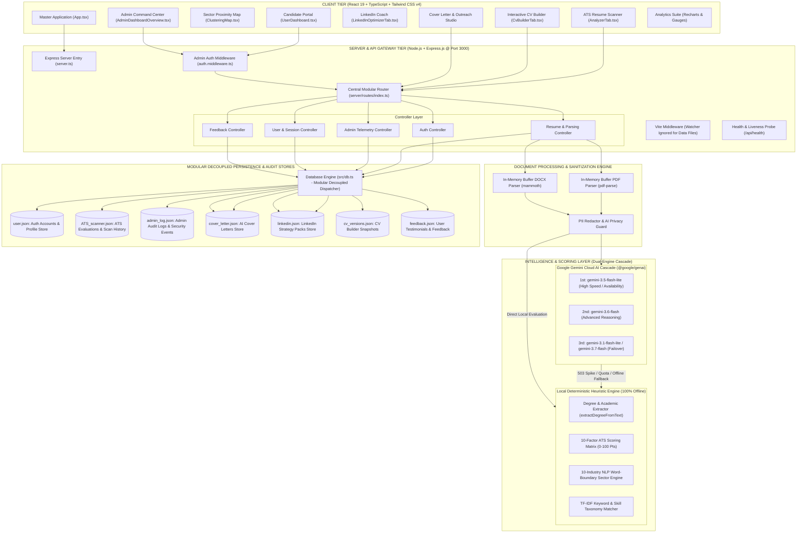
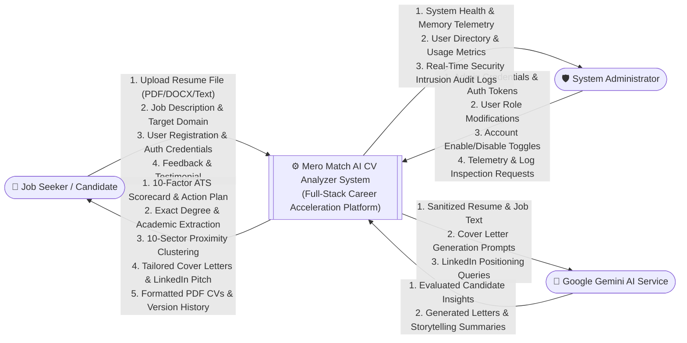
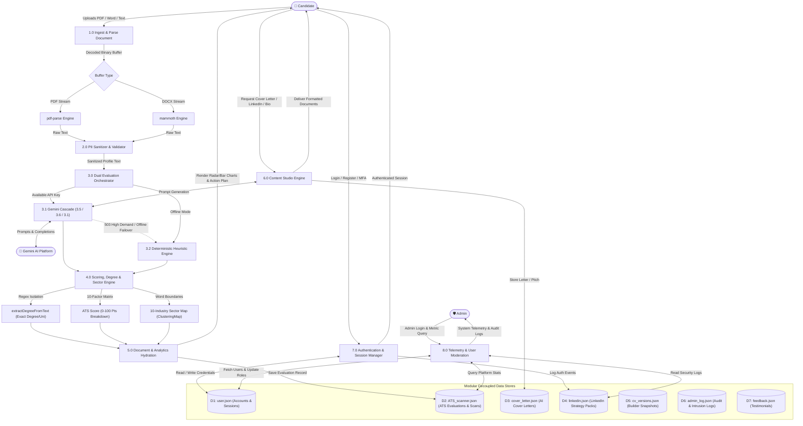
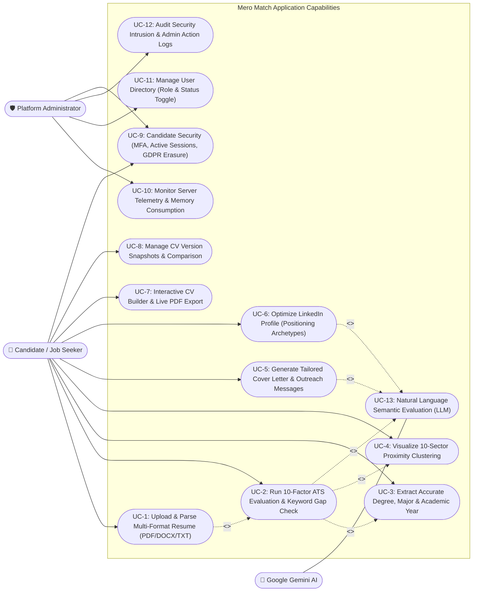

# Mero Match - AI CV Analyzer & Career Acceleration Suite

> **Tagline:** *"Upload. Analyze. Match. Get Hired."*  
> **Platform:** Full-Stack Web Application (Node.js + Express.js + React 19 + TypeScript + Vite + Tailwind CSS v4 + Google Gemini AI)

---

## 📑 Table of Contents
1. [Executive Summary & Vision](#1-executive-summary--vision)
2. [Key Features & Capabilities](#2-key-features--capabilities)
3. [Step-by-Step Guide: Running Locally in VS Code](#3-step-by-step-guide-running-locally-in-vs-code)
4. [System Architecture, DFD & Use Case Diagrams](#4-system-architecture-dfd--use-case-diagrams)
   - [4.1 System Architecture Diagram](#41-system-architecture-diagram)
   - [4.2 Data Flow Diagram (DFD) - Level 0 Context Diagram](#42-data-flow-diagram-dfd---level-0-context-diagram)
   - [4.3 Data Flow Diagram (DFD) - Level 1 Detailed Pipeline](#43-data-flow-diagram-dfd---level-1-detailed-pipeline)
   - [4.4 Use Case Diagram](#44-use-case-diagram)
5. [Core Engine Mechanics & Algorithms](#5-core-engine-mechanics--algorithms)
   - [A. Multi-Format Resume Ingestion (PDF / DOCX Parsing)](#a-multi-format-resume-ingestion-pdf--docx-parsing)
   - [B. 10-Factor ATS Scoring Matrix (0–100)](#b-10-factor-ats-scoring-matrix-0100)
   - [C. Intelligent Degree & Education Extraction](#c-intelligent-degree--education-extraction)
   - [D. Multi-Industry NLP Sector Clustering Map](#d-multi-industry-nlp-sector-clustering-map)
   - [E. Resilient Multi-Model Gemini AI Cascade & Offline Heuristics](#e-resilient-multi-model-gemini-ai-cascade--offline-heuristics)
   - [F. LinkedIn Profile Optimizer & Career Blueprint](#f-linkedin-profile-optimizer--career-blueprint)
   - [G. Cover Letter & Outreach Studio](#g-cover-letter--outreach-studio)
   - [H. Persistence Layer & Live Watcher Isolation](#h-persistence-layer--live-watcher-isolation)
   - [I. Admin Dashboard & Telemetry](#i-admin-dashboard--telemetry)
6. [Academic Defense & Viva Q&A Guide](#6-academic-defense--viva-qa-guide)
7. [Credentials & Configuration Reference](#7-credentials--configuration-reference)

---

## 1. Executive Summary & Vision

In modern recruitment, over **98% of Fortune 500 organizations** and a growing majority of tech companies rely on **Applicant Tracking Systems (ATS)** to filter candidate applications before human recruiters review them. Due to non-standard resume styling, omitted industry keywords, unquantified achievements, and miscategorized academic credentials, **over 75% of qualified job seekers are rejected at the parsing gate**.

**Mero Match - AI CV Analyzer** is an end-to-end full-stack career platform designed to democratize hiring transparency:
- **Accurate Resume Parsing**: Ingests raw PDFs and Microsoft Word (.docx) documents in-memory without data leakage.
- **Transparent 10-Factor ATS Evaluation**: Breaks down scores (0–100) across transparent criteria including keyword density, skill fit, achievement measurability (STAR formula), and section integrity.
- **Accurate Degree & Major Recognition**: Employs an intelligent academic parser (`extractDegreeFromText`) that extracts candidates' genuine degrees (e.g., *Bachelor of Business Administration (BBA)*, *B.Sc. in CSIT / Computer Science*, *MBA*, *Higher Secondary (+2)*, *Diplomas*) instead of relying on coarse defaults.
- **Multi-Industry Domain Clustering**: Analyzes skill signatures across 10 specialized industry tracks (including *Digital Marketing*, *Business Analysis*, *Software Engineering*, *Data Science & AI*, *Product Design*, *Finance*, and *HR*) with strict word-boundary pattern matching.
- **Enterprise-Grade Availability**: Features a multi-model fallback cascade across Google Gemini Flash models (`gemini-3.5-flash-lite`, `gemini-3.6-flash`, `gemini-3.1-flash-lite`) and an instant offline **Heuristic NLP Engine** (`src/heuristic_service.ts`), ensuring 100% uptime with zero quota bottlenecks.

---

## 2. Key Features & Capabilities

- 🎯 **ATS Resume Scanner**: Drag-and-drop file upload with real-time scoring, keyword gap diagnosis, and prioritized action badges.
- 🎓 **Intelligent Degree Parser**: Extracts true degrees, institutions, and graduation years directly from candidate text.
- 🌐 **Sector & Keyword Clustering Map**: Visualizes candidate affinity across 10 modern economic sectors with keyword proximity bars.
- 📝 **Dynamic CV Builder**: Clean multi-section interactive editor with live template rendering and PDF download.
- 💼 **LinkedIn Profile Coach**: Converts formal 3rd-person resume bullets into engaging 1st-person storytelling summaries, search-optimized headlines, and banner suggestions.
- ✉️ **Cover Letter & Cold Outreach Studio**: Generates anti-hallucination, metric-aligned job application letters and networking DMs.
- 📊 **Visual Analytics (Recharts)**: Interactive Skill Competency Radars, Category Distribution Bar Charts, and Experience Fit visualizers.
- 🛡️ **Privacy & PII Sanitizer**: Client-side and server-side regular expression masking for phone numbers, emails, and sensitive identifiers.
- 🔐 **User Dashboard & Security Center**: Version control for past CV evaluations, saved cover letters, active device session management, and GDPR-compliant one-click data deletion.
- ⚡ **Admin Command Center**: Real-time system health telemetry, memory usage, API latency tracking, user role management, and audit logs.

---

## 3. Step-by-Step Guide: Running Locally in VS Code

Follow these straightforward steps to run **Mero Match** locally:

### 📋 Prerequisites
1. **Node.js** (v18.x or higher, Node.js 20 LTS recommended): [nodejs.org](https://nodejs.org/)
2. **Visual Studio Code**: [code.visualstudio.com](https://code.visualstudio.com/)
3. **Git** (optional): [git-scm.com](https://git-scm.com/)

---

### Step 1: Clone or Download Repository
```bash
git clone https://github.com/your-username/mero-match-cv-analyzer.git
cd mero-match-cv-analyzer
```
*(Or extract the downloaded ZIP folder to your workspace directory).*

---

### Step 2: Open in VS Code
1. Launch **Visual Studio Code**.
2. Select **File -> Open Folder...** and choose the project directory.

---

### Step 3: Install Dependencies
Open your integrated terminal (`Ctrl + ~` on Windows/Linux or `Cmd + ~` on macOS) and run:
```bash
npm install
```
This installs all client and server packages, including React 19, Tailwind CSS v4, Express, Lucide Icons, Recharts, and Google GenAI SDK.

---

### Step 4: Configure Environment Variables
1. Create a `.env` file in the project root based on `.env.example`:
   ```bash
   cp .env.example .env
   ```
2. Set your configuration in `.env`:
   ```env
   # Google Gemini API Key (Get a free key from https://aistudio.google.com/app/apikey)
   GEMINI_API_KEY=your_gemini_api_key_here

   # Server Port
   PORT=3000
   ```
   > **Note on Offline Mode:** If `GEMINI_API_KEY` is omitted or quota is exhausted, the application automatically switches to its local **Deterministic Heuristic Engine** with 0 downtime.

---

### Step 5: Start the Development Server
```bash
npm run dev
```
The server will boot on port 3000 with Vite middleware:
```
Server running on http://localhost:3000
```

---

### Step 6: Launch in Browser
Navigate to:
```
http://localhost:3000
```
Test the health probe at `http://localhost:3000/api/health` to confirm the backend is responding with `{"status":"ok"}`.

---

### Step 7: Build for Standalone Production
```bash
npm run build
npm start
```
`npm run build` compiles the React frontend via Vite into `dist/` and bundles `server.ts` into a standalone CommonJS executable at `dist/server.cjs` via `esbuild`.

---

## 4. System Architecture, DFD & Use Case Diagrams

### 4.1 System Architecture Diagram



---

### 4.2 Data Flow Diagram (DFD) - Level 0 Context Diagram

The Level 0 Context Diagram illustrates the system boundary, external actors (Job Seeker / Candidate, System Administrator, and Google Gemini AI Platform), and primary data exchanges.



---

### 4.3 Data Flow Diagram (DFD) - Level 1 Detailed Pipeline

The Level 1 DFD decomposes the system into functional sub-processes, showing data transformations, in-memory buffers, dual AI evaluation pathways, and data store read/write operations.



---

### 4.4 Use Case Diagram

The Use Case Diagram specifies all functional capabilities grouped by actor roles (Job Seeker / Candidate, Platform Administrator, and External AI Service).



---

## 5. Core Engine Mechanics & Algorithms

### A. Multi-Format Resume Ingestion (PDF / DOCX Parsing)
1. The user uploads a `.pdf`, `.docx`, or `.txt` document or pastes raw text into `src/components/AnalyzerTab.tsx`.
2. The browser converts the document to a Base64 string via the HTML5 `FileReader` API.
3. On the Express server (`server/controllers/resume.controller.ts`):
   - **PDFs**: Ingested via binary buffer into `pdf-parse`, extracting clean text streams while discarding broken encoding characters.
   - **DOCX**: Ingested via `mammoth.extractRawText`, parsing Microsoft Word XML structures into semantic paragraphs.
4. Extracted text is normalized and sanitized before passing to the evaluation pipeline.

---

### B. 10-Factor ATS Scoring Matrix (0–100)
Every resume is scored against target job descriptions across 10 deterministic factors:

| # | Factor | Max Pts | Evaluation Methodology |
| :--- | :--- | :--- | :--- |
| **1** | **Keyword Match** | 15 pts | Term frequency and contextual placement of critical job requirements. |
| **2** | **Skills Match** | 15 pts | Overlap of hard technical skills and core domain proficiencies. |
| **3** | **Experience Relevance** | 15 pts | Seniority, responsibility breadth, and domain alignment. |
| **4** | **Education & Degree Match** | 10 pts | Verified academic degrees, majors, and institutional credentials. |
| **5** | **Job Title Match** | 10 pts | Similarity between target designation and past candidate roles. |
| **6** | **Formatting & Structure** | 10 pts | Standard headers, readable font hierarchy, absence of broken tables. |
| **7** | **Section Completeness** | 5 pts | Presence of Summary, Experience, Education, Skills, and Contact sections. |
| **8** | **Achievement Strength** | 10 pts | Scans bullet points for the **STAR / XYZ formula** (Action Verb + Quantified Number + Outcome). |
| **9** | **Contact & Social Info** | 5 pts | Validates clean email, phone number, LinkedIn URL, and portfolio links. |
| **10**| **ATS Parser Readability** | 5 pts | Validates clean character streams free of non-standard glyphs. |

**Score Benchmark:**
- `80 – 100`: **Interview Ready** (Passed top ATS filters).
- `60 – 79`: **Needs Optimization** (Missing core keywords or quantified metrics).
- `0 – 59`: **High Rejection Risk** (Structural deficiencies or major skill omissions).

---

### C. Intelligent Degree & Education Extraction
In earlier systems, basic regex matching often defaulted candidates to generic "Bachelor of Science" degrees. **Mero Match** features an intelligent academic parser in `extractDegreeFromText` (`src/heuristic_service.ts`):
- Delimits education and academic credential blocks from the rest of the resume.
- Accurately captures full degree titles with majors:
  - *Bachelor of Business Administration (BBA)*
  - *B.Sc. in CSIT / Computer Science*
  - *Bachelor of Computer Applications (BCA)*
  - *Bachelor of Technology / Engineering (B.Tech / B.E.)*
  - *Master of Business Administration (MBA) / M.S. / M.Sc.*
  - *Higher Secondary (+2 / High School) & Associate Diplomas*
  - *Ph.D. / Doctorate Programs*
- Preserves university names and graduation years, eliminating inaccurate credential flags.

---

### D. Multi-Industry NLP Sector Clustering Map
The `ClusteringMap.tsx` component calculates candidate alignment across 10 modern economic sectors using strict word-boundary regular expressions:
1. **Digital Marketing & Growth** (SEO, SEM, Google Ads, GA4, Meta Ads, Email Marketing)
2. **Business Analysis & Strategy** (BRD, FRD, BPMN, Power BI, Jira, Agile/Scrum)
3. **Web & Software Engineering** (TypeScript, React, Next.js, Node.js, Spring Boot, Go, Python)
4. **Data Science, Analytics & AI** (Machine Learning, PyTorch, Pandas, NLP, GenAI, SQL)
5. **UI/UX & Product Design** (Figma, Wireframing, User Research, Design Systems)
6. **Finance, Accounting & Valuation** (Financial Modeling, Excel, DCF, GAAP, Tax, Auditing)
7. **Human Resources & Talent** (Recruitment, HRIS, Talent Acquisition, Payroll)
8. **Sales & Customer Success** (Salesforce, CRM, Pipeline Management, CSAT, Deal Closing)
9. **Cloud & Systems DevOps** (Docker, Kubernetes, AWS, Terraform, CI/CD, Linux)
10. **Mobile App Innovation** (Flutter, React Native, Swift, Kotlin, iOS/Android)

---

### E. Resilient Multi-Model Gemini AI Cascade & Offline Heuristics
To prevent 503 high-demand throttles and latency spikes, **Mero Match** employs an automated multi-tier cascade in `src/gemini_service.ts`, `server/controllers/resume.controller.ts`, and `src/services/gemini.service.ts`:
1. **Primary**: `gemini-3.5-flash-lite` (Ultra-fast, lowest latency, high throughput).
2. **Tier 2**: `gemini-3.6-flash` (Advanced reasoning for nuanced career evaluation).
3. **Tier 3**: `gemini-3.1-flash-lite` & `gemini-3.7-flash` (Failover redundancy).
4. **Zero-Failure Fallback**: `src/heuristic_service.ts` (Deterministic offline rule engine requiring 0 internet connectivity or API keys).

---

### F. LinkedIn Profile Optimizer & Career Blueprint
Transforms static resume bullet points into recruiter-optimized personal branding:
- **Tone Shift**: Converts dry 3rd-person past tense into engaging 1st-person narrative.
- **Positioning Archetypes**:
  - *Technical Leader & Architect*
  - *0-to-1 Product Engineer*
  - *Recruiter SEO & Keyword Stack*
  - *Visionary Storyteller*
- **Banner Theme Suggestions**: Color pairings and styling advice.
- **5-Step Action Blueprint**: Actionable checklist covering headlines, About summaries, featured media, skill endorsements, and recommendations.

---

### G. Cover Letter & Outreach Studio
- **Cover Letter Generator**: Synthesizes the candidate's authentic achievements with target company mission statements into a crisp, three-part letter (The Hook, The Metric-Driven Alignment, The Confident Call-to-Action).
- **Outreach Email Studio**: One-click cold recruiter messages, hiring manager outreach, and interview thank-you notes.

---

### H. Modular Persistence Layer & Live Watcher Isolation
- **Decoupled Modular JSON Stores (`src/db.ts`)**: Instead of storing all jumbled records in a single monolithic file, each component manages its own isolated, human-readable data store:
  - `data/user.json` (mirrored to root `user.json`): User accounts, authentication credentials, and roles.
  - `data/ATS_scanner.json` (mirrored to root `ATS_scanner.json`): Analyzed CV scans, ATS match scores, and parsed degree/skills metrics.
  - `data/admin_log.json`: System administrator audit trails and security intrusion detection events.
  - `data/cover_letter.json`: Generated cover letters and customized application drafts.
  - `data/linkedin.json`: Executive LinkedIn profile optimization packages and outreach notes.
  - `data/cv_versions.json`: CV Builder revision history, diff snapshots, and candidate drafts.
  - `data/feedback.json`: User star ratings, comments, and testimonials.
- **Vite Watcher Isolation (`vite.config.ts` & `server.ts`)**: Configured comprehensive `watch.ignored` patterns for `**/data/**`, `**/user.json`, `**/ATS_scanner.json`, `**/cv_analyzed.json`, `**/admin_log.json`, `**/cover_letter.json`, `**/linkedin.json`, `**/privacy_audit.json`, and `**/*.json.tmp*`. This prevents disk writes from triggering live frontend reload loops.
- **Atomic Operations & Auto-Migration**: Database bootstrap automatically discovers and migrates legacy data into the respective modular files upon startup.

---

### I. Admin Dashboard & Telemetry
Accessible via administrator accounts (`thapakaji@gmail.com` or `admin` / `password`):
- Server uptime, memory consumption, and CPU load metrics.
- Real-time **Modular JSON Data Stores Status** table tracking record counts and file byte sizes.
- API response latency and health probes.
- User management table (role assignment and account status toggles).
- Live security event logs and administrative audit trail.

---

## 6. Academic Defense & Viva Q&A Guide

| # | Anticipated Viva Question | Model Answer |
| :--- | :--- | :--- |
| **Q1** | **Why did you implement a hybrid AI + Heuristic architecture instead of relying only on an LLM?** | Pure LLM architectures suffer from latency, financial cost, rate limits (HTTP 429), and temporary high-demand outages (HTTP 503). By engineering a local deterministic heuristic engine in `src/heuristic_service.ts`, **Mero Match** guarantees **100% platform availability and reproducible 0–100 mathematical scoring** even without an active internet connection. |
| **Q2** | **How do you address the hallucination problem in automated resume scoring?** | We implement rigid anti-hallucination prompt constraints paired with a JSON Schema response format. The model is strictly instructed to act as an *evaluator and formatting coach*, forbidden from fabricating unlisted companies, degrees, dates, or numerical achievements. |
| **Q3** | **How does Mero Match solve false-positive degree matching?** | Rather than performing naive substring matches, `extractDegreeFromText` isolates the education section and executes targeted regular expressions with boundary markers. This accurately distinguishes between BBA, BCA, B.Sc. CSIT, B.Tech, MBA, M.S., and High School credentials. |
| **Q4** | **How is file upload security and data privacy enforced?** | File uploads are processed in-memory as binary buffers using `pdf-parse` and `mammoth` without permanent temporary file writes. In addition, regex PII sanitizers strip credit cards and SSNs, and users can trigger one-click GDPR-compliant data erasure at any time. |
| **Q5** | **Why and how did you decouple the database into separate modular JSON files?** | Monolithic persistence files (e.g. jumbled `db.json`) cause merge conflicts, file contention during concurrent writes, and poor maintainability. We refactored `src/db.ts` into a modular storage engine with dedicated files for each component (`user.json`, `ATS_scanner.json`, `admin_log.json`, `cover_letter.json`, `linkedin.json`). We paired this with `watch.ignored` rules in `vite.config.ts` and `server.ts` to prevent file I/O from causing browser refresh loops. |

---

## 7. Credentials & Configuration Reference

### Administrator Login Credentials
- **Email / Username:** `thapakaji@gmail.com` (or `admin`)
- **Password:** `password`
- **Role:** Administrator (full access to system health, telemetry, and user directory)

### NPM Scripts Reference
| Command | Action |
| :--- | :--- |
| `npm run dev` | Boots Express backend with Vite middleware via `tsx server.ts` on port 3000. |
| `npm run build` | Compiles the React SPA to `dist/` and bundles `server.ts` to `dist/server.cjs`. |
| `npm start` | Executes the compiled production bundle via `node dist/server.cjs`. |
| `npm run lint` | Runs `tsc --noEmit` to validate all TypeScript types and imports. |

---

*Mero Match - Developed for academic project defense and real-world career empowerment.*
